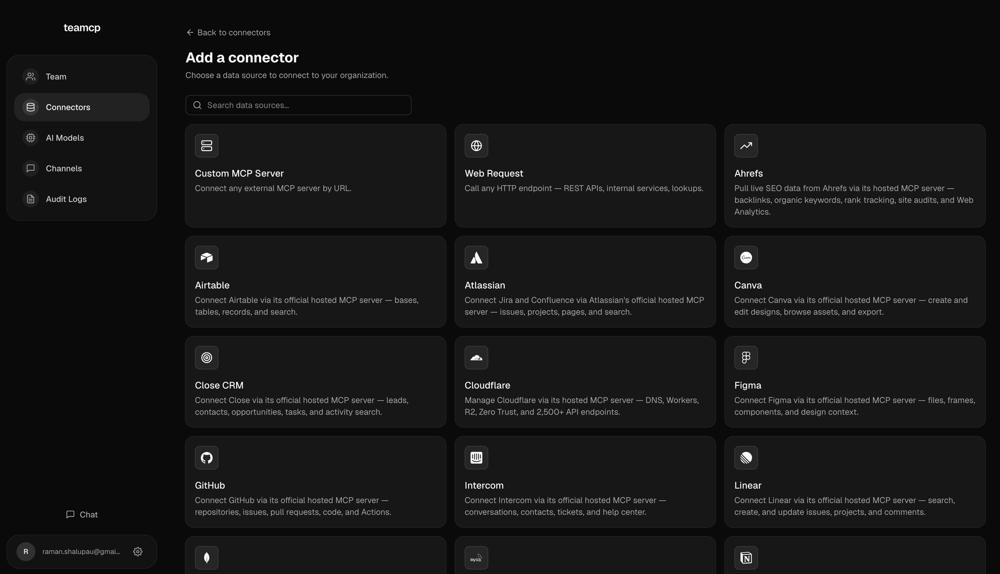
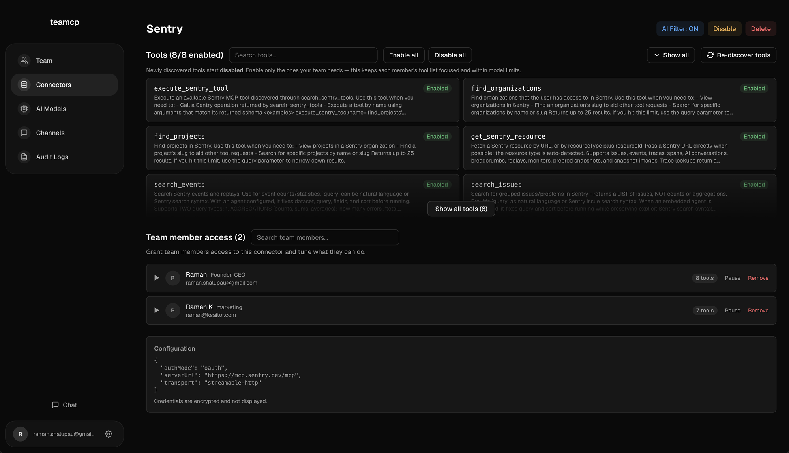
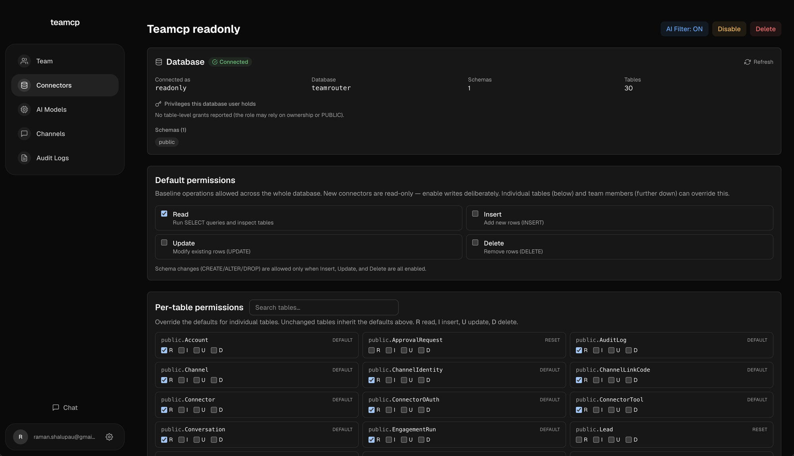

# Teamcp

Self-hostable MCP gateway with per-member AI tool access control. Give your team fine-grained access to databases, APIs, and AI tools — enforced through a layered permission engine with optional AI-powered filtering.

## Screenshots

Connect data sources from the connector gallery — official hosted MCP servers, databases, or any custom MCP server:



Control which tools each connector exposes and which team members can use them:



For databases, set default and per-table read/insert/update/delete permissions:



## Deploy

Teamcp ships as a standard container and also builds cleanly with [Nixpacks](https://nixpacks.com), so it runs on any platform that supports either (Railway, Render, Coolify, Fly, a plain VM, etc.).

- **Docker / Docker Compose** — see [Quick Start](#quick-start-docker) below.
- **Nixpacks** — point your platform at this repo; the build is auto-detected and the app starts via `bin/start.sh`.

In all cases provide a `DATABASE_URL` plus the required secrets (see [Environment Variables](#environment-variables)). The schema is synced automatically on startup, then open the app URL to create your admin account.

## Quick Start (Docker)

```bash
# Clone the repo
git clone https://github.com/ksaitor/teamrouter.git
cd teamrouter

# Copy env file and set your secrets
cp .env.example .env
# Edit .env — at minimum set ENCRYPTION_KEY and AUTH_SECRET:
#   openssl rand -hex 32    → ENCRYPTION_KEY
#   openssl rand -base64 32 → AUTH_SECRET

# Start with Docker Compose
docker compose up -d
```

The admin dashboard is available at `http://localhost:3000` and the MCP server at `http://localhost:3001`.

## Environment Variables

| Variable | Required | Description |
|---|---|---|
| `DATABASE_URL` | Yes | PostgreSQL connection string |
| `ENCRYPTION_KEY` | Yes | 64 hex chars for encrypting connector credentials (`openssl rand -hex 32`) |
| `AUTH_SECRET` | Yes | Secret for signing session tokens (`openssl rand -base64 32`) |
| `ANTHROPIC_API_KEY` | No | Enables AI-powered permission filtering |
| `APP_URL` | No | Public URL of admin UI (default: `http://localhost:3000`) |
| `MCP_BASE_URL` | No | Public URL of MCP server (default: `http://localhost:3001`) |
| `MCP_PORT` | No | MCP server port (default: `3001`) |
| `GOOGLE_CLIENT_ID` / `GOOGLE_CLIENT_SECRET` | No | Google OAuth |
| `GITHUB_CLIENT_ID` / `GITHUB_CLIENT_SECRET` | No | GitHub OAuth |
| `SMTP_URL` | No | SMTP connection string for email notifications |
| `SMTP_FROM` | No | From address for outgoing email (default: `Teamcp <noreply@teamcp.ai>`) |

## Architecture

Teamcp runs two servers in a single process:

- **Port 3000** — Admin dashboard (Next.js) for managing members, connectors, and permissions
- **Port 3001** — MCP SSE server that team members connect their AI tools to

### Permission Engine (4 Layers)

1. **Toggles** — Simple on/off access controls (instant)
2. **Native permissions** — Connector-specific rules (instant)
3. **Custom scripts** — Admin-written JS/TS sandboxed functions (fast)
4. **AI filtering** — Post-execution Claude evaluation with caching (async)

## Development

```bash
bun install
bunx prisma generate
bunx prisma db push
bun run dev         # Admin UI on :3000
bun run mcp:dev     # MCP server on :3001
```

## License

Teamcp is [Fair Source](https://fair.io) software, licensed under the
[Fair Core License, Version 1.0, ALv2 Future License](LICENSE.md) (FCL-1.0-ALv2).

You can self-host, read, modify, and redistribute Teamcp for any purpose that
doesn't compete with our commercial offering. Paid features are gated by
license keys, which must not be circumvented. Each version automatically
converts to the Apache License 2.0 two years after its release.

Copyright © 2026 [Ksaitor Media Pte. Ltd.](https://teamcp.ai)

## Contributing

Contributions are welcome! By submitting a pull request you agree to the
[Contributor License Agreement](CLA.md) — you keep ownership of your code and
grant us the license needed to keep the project sustainable.

---

Created by [Raman Shalupau](https://github.com/ksaitor)
